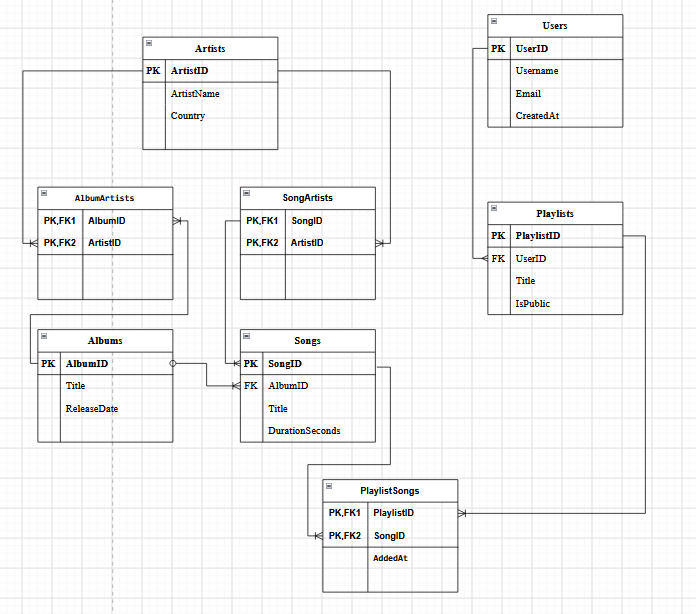

# Домашнее задание 2: Проектирование и нормализация базы данных

## Part 1: Выбор сценария, цели и задачи

### Выбранный сценарий:
**Сценарий 4: Сервис потоковой передачи музыки**  
Система управляет информацией об артистах, альбомах, треках, пользователях и их плейлистах.

### Цели и задачи системы:
* **Цель:** Спроектировать нормализованную схему базы данных PostgreSQL для музыкального сервиса с поддержкой целостности данных и гибкой бизнес-логики.
* **Задачи:**
  1. Организовать хранение каталога исполнителей, их альбомов и треков с поддержкой песен без альбома и совместных треков/альбомов.
  2. Реализовать хранение аккаунтов пользователей и их плейлистов.
  3. Настроить ограничения СУБД с помощью `PRIMARY KEY`, `FOREIGN KEY`, `CHECK`, `UNIQUE`.

---

## Part 2: Проектирование Базы Данных и Документация

### Идентификация Сущностей и Атрибутов:
1. **Артисты (`Artists`):** Исполнители и музыкальные коллективы (`ArtistID`, `ArtistName`, `Country`).
2. **Альбомы (`Albums`):** Музыкальные альбомы (`AlbumID`, `Title`, `ReleaseDate`).
3. **Песни (`Songs`):** Музыкальные треки (`SongID`, `Title`, `DurationSeconds`, `AlbumID`).
4. **Пользователи (`Users`):** Слушатели сервиса (`UserID`, `Username`, `Email`, `CreatedAt`).
5. **Плейлисты (`Playlists`):** Подборки треков пользователей (`PlaylistID`, `Title`, `IsPublic`, `UserID`).
6. **Артисты альбома (`AlbumArtists`):** Совместные альбомы (`AlbumID`, `ArtistID`).
7. **Артисты песни (`SongArtists`):** Совместные треки (`SongID`, `ArtistID`).
8. **Песни в плейлистах (`PlaylistSongs`):** Состав плейлистов (`PlaylistID`, `SongID`, `AddedAt`).

---

### Проектирование Таблиц 

#### 1. Table Name: `Artists`
* **Description:** Хранит сведения о музыкальных исполнителях и группах.
* **Attributes:**
  * `ArtistID`: `INTEGER`, PK
  * `ArtistName`: `VARCHAR(150)`, NOT NULL, UNIQUE
  * `Country`: `VARCHAR(100)`
* **Constraints:**
  * `PK_Artists`: `PRIMARY KEY (ArtistID)`

#### 2. Table Name: `Albums`
* **Description:** Хранит информацию о музыкальных альбомах.
* **Attributes:**
  * `AlbumID`: `INTEGER`, PK
  * `Title`: `VARCHAR(255)`, NOT NULL
  * `ReleaseDate`: `DATE`, NOT NULL
* **Constraints:**
  * `PK_Albums`: `PRIMARY KEY (AlbumID)`
  * `CHK_ReleaseDate`: `CHECK (ReleaseDate >= '1900-01-01' AND ReleaseDate <= '2100-12-31')`

#### 3. Table Name: `AlbumArtists`
* **Description:** Промежуточная таблица для реализации связи **«многие-ко-многим»** между альбомами и артистами (у альбома может быть несколько авторов).
* **Attributes:**
  * `AlbumID`: `INTEGER`, FK (REFERENCES `Albums` ON DELETE CASCADE), NOT NULL
  * `ArtistID`: `INTEGER`, FK (REFERENCES `Artists` ON DELETE CASCADE), NOT NULL
* **Constraints:**
  * `PK_AlbumArtists`: `PRIMARY KEY (AlbumID, ArtistID)`

#### 4. Table Name: `Songs`
* **Description:** Хранит данные о конкретных музыкальных композициях. Поле `AlbumID` имеет значение `NULL`, если песня выходила без альбома.
* **Attributes:**
  * `SongID`: `INTEGER`, PK
  * `Title`: `VARCHAR(255)`, NOT NULL
  * `DurationSeconds`: `INTEGER`, NOT NULL
  * `AlbumID`: `INTEGER`, FK (REFERENCES `Albums` ON DELETE SET NULL), NULL
* **Constraints:**
  * `PK_Songs`: `PRIMARY KEY (SongID)`
  * `FK_Songs_Albums`: `FOREIGN KEY (AlbumID) REFERENCES Albums (AlbumID) ON DELETE SET NULL`
  * `CHK_Duration`: `CHECK (DurationSeconds > 0)`

#### 5. Table Name: `SongArtists`
* **Description:** Промежуточная таблица для реализации связи **«многие-ко-многим»** между треками и артистами (поддержка совместных треков).
* **Attributes:**
  * `SongID`: `INTEGER`, FK (REFERENCES `Songs` ON DELETE CASCADE), NOT NULL
  * `ArtistID`: `INTEGER`, FK (REFERENCES `Artists` ON DELETE CASCADE), NOT NULL
* **Constraints:**
  * `PK_SongArtists`: `PRIMARY KEY (SongID, ArtistID)`

#### 6. Table Name: `Users`
* **Description:** Хранит учетные записи зарегистрированных пользователей.
* **Attributes:**
  * `UserID`: `INTEGER`, PK
  * `Username`: `VARCHAR(100)`, NOT NULL, UNIQUE
  * `Email`: `VARCHAR(255)`, NOT NULL, UNIQUE
  * `CreatedAt`: `TIMESTAMP`, NOT NULL, DEFAULT `CURRENT_TIMESTAMP`
* **Constraints:**
  * `PK_Users`: `PRIMARY KEY (UserID)`

#### 7. Table Name: `Playlists`
* **Description:** Содержит заголовки и настройки пользовательских плейлистов.
* **Attributes:**
  * `PlaylistID`: `INTEGER`, PK
  * `Title`: `VARCHAR(255)`, NOT NULL
  * `IsPublic`: `BOOLEAN`, NOT NULL, DEFAULT `TRUE`
  * `UserID`: `INTEGER`, FK (REFERENCES `Users` ON DELETE CASCADE), NOT NULL
* **Constraints:**
  * `PK_Playlists`: `PRIMARY KEY (PlaylistID)`
  * `FK_Playlists_Users`: `FOREIGN KEY (UserID) REFERENCES Users (UserID) ON DELETE CASCADE`
  * `CHK_PlaylistTitle`: `CHECK (LENGTH(Title) > 0)`

#### 8. Table Name: `PlaylistSongs`
* **Description:** Таблица для реализации связи **«многие-ко-многим»** между плейлистами и треками. Уникальность записи обеспечивается составным первичным ключом `(PlaylistID, SongID)`.
* **Attributes:**
  * `PlaylistID`: `INTEGER`, FK (REFERENCES `Playlists` ON DELETE CASCADE), NOT NULL
  * `SongID`: `INTEGER`, FK (REFERENCES `Songs` ON DELETE CASCADE), NOT NULL
  * `AddedAt`: `TIMESTAMP`, NOT NULL, DEFAULT `CURRENT_TIMESTAMP`
* **Constraints:**
  * `PK_PlaylistSongs`: `PRIMARY KEY (PlaylistID, SongID)`
  * `FK_PlaylistSongs_Playlists`: `FOREIGN KEY (PlaylistID) REFERENCES Playlists (PlaylistID) ON DELETE CASCADE`
  * `FK_PlaylistSongs_Songs`: `FOREIGN KEY (SongID) REFERENCES Songs (SongID) ON DELETE CASCADE`

---

### Поведение при удалении данных (ON DELETE):
* **При удалении пользователя (`Users`):** Все его плейлисты автоматически удаляются (`ON DELETE CASCADE`).
* **При удалении альбома (`Albums`):** Связанные песни не удаляются из системы, а их `AlbumID` сбрасывается в `NULL` (`ON DELETE SET NULL`), переводя трек в статус без альбома.
* **При удалении песни или плейлиста:** Соответствующие записи из связующих таблиц `PlaylistSongs`, `SongArtists` и `AlbumArtists` удаляются автоматически (`ON DELETE CASCADE`).

---

### Анализ Нормализации (3NF):
* **1NF:** Все значения атрибутов неделимы (атомарны), отсутствуют дублирующиеся группы. У каждой таблицы задан первичный ключ (простой или составной).
* **2NF:** Таблицы находятся в 1NF, все неключевые столбцы полностью зависят от всего первичного ключа целиком.
* **3NF:** Таблицы находятся во 2NF, отсутствуют транзитивные зависимости.

---

### Описание Взаимосвязей:
* **`Artists` и `Albums` (Многие-ко-Многим):** Реализовано через таблицу `AlbumArtists`. У одного альбома может быть несколько авторов, и один артист может выпустить несколько альбомов.
* **`Artists` и `Songs` (Многие-ко-Многим):** Реализовано через таблицу `SongArtists`. У одной песни может быть несколько исполнителей (feat), и один артист участвует в создании многих треков.
* **`Albums` и `Songs` (Один-ко-Многим):** В один альбом входит несколько песен. Если песня выходила без альбома (сингл), то `Songs.AlbumID` равно `NULL`.
* **`Users` и `Playlists` (Один-ко-Многим):** Один пользователь может создать множество плейлистов, у каждого плейлиста строго один владелец.
* **`Playlists` и `Songs` (Многие-ко-Многим):** Реализовано через промежуточную таблицу `PlaylistSongs` с составным первичным ключом `PRIMARY KEY (PlaylistID, SongID)`.

---

## Part 3: ER-Диаграмма
